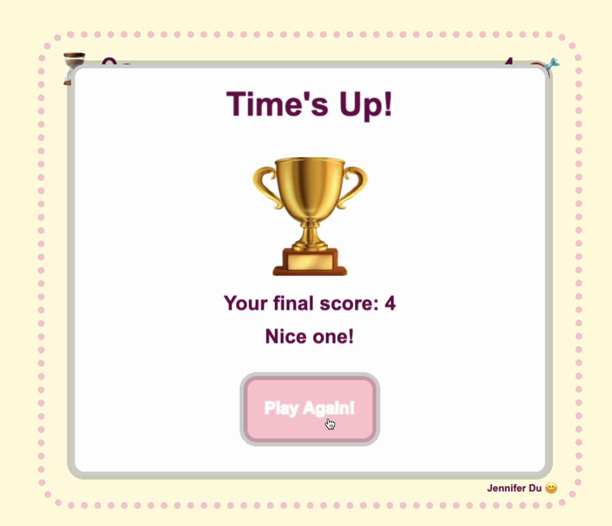
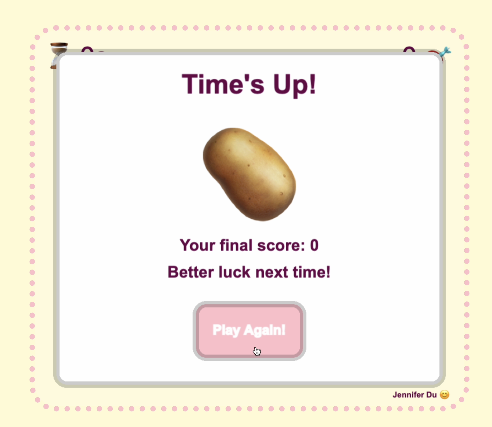
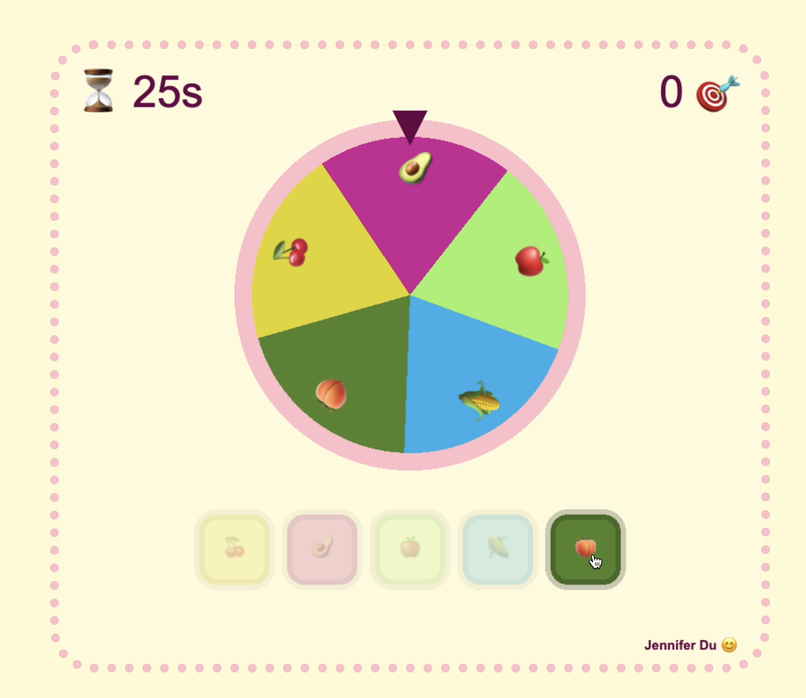
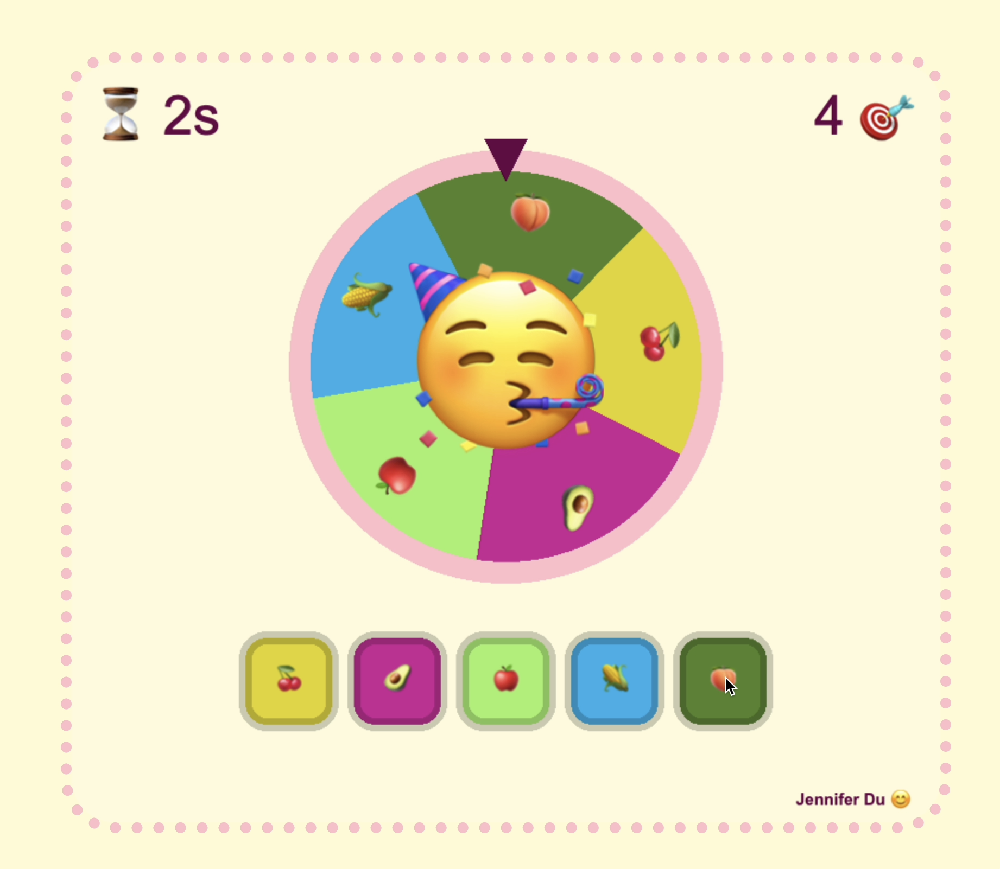

# Jennifer Du - Spinwheel

# About
Simple spin the wheel game I built using PixiJS and JavaScript 😊

## Run instructions:
1. Install dependencies `npm i`
2. Start `npm start`
3. Game is availabe on `http://localhost:8080/`

There are some customisable values at the top of app.js

## How to play:

You have 30 seconds to try as many times to stop the wheel on your selection.

Start the game by clicking on the button with the value you think the spinner will stop at! This will start the game and spin the wheel, and the countdown will also start decreasing!

You have 30 seconds to make as many spins and land on your selection. The duration of each spin is random.

If it lands on your guess, you will gain a point!

Keep making your selection after every spin. Once the 30 seconds are up, the game ends!

Once the game ends, you will be shown a popup of your final score, and a button `Play Again!` to replay.

## Preview

Win screen

Lose screen

Mid-spin

Landed
